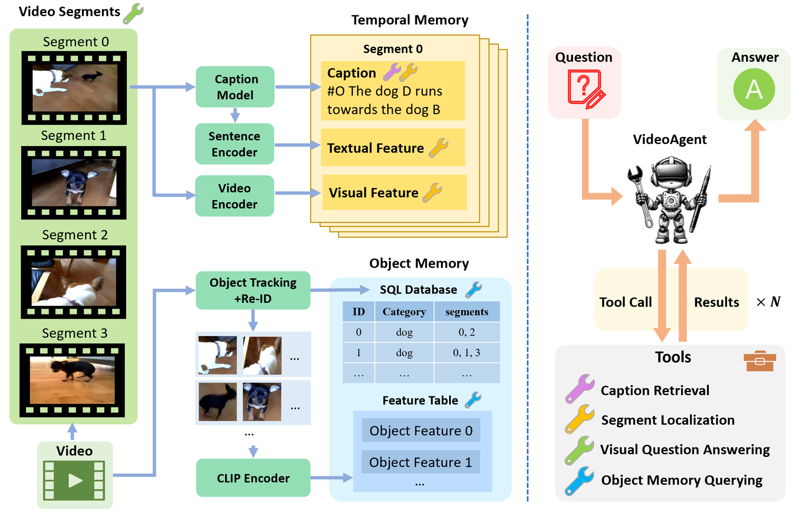
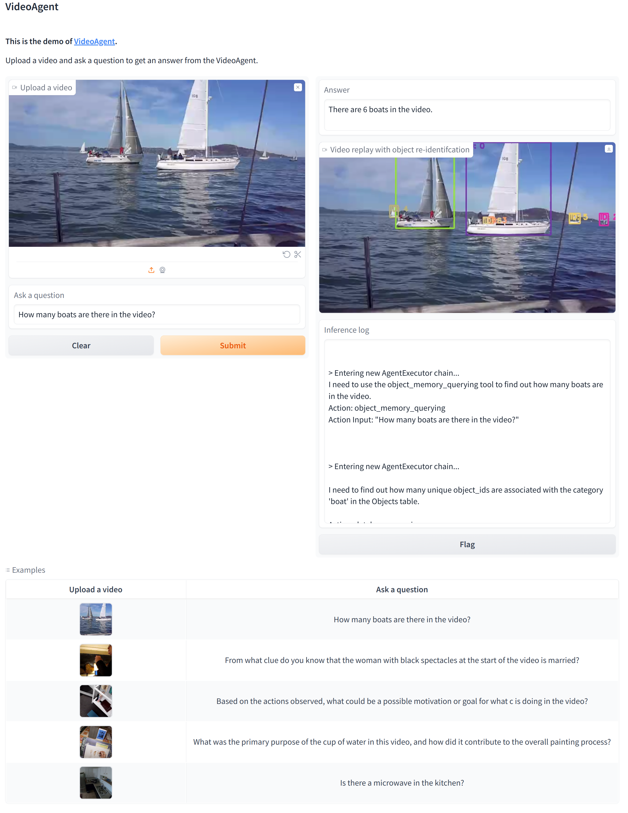

<h1>VideoAgent: A Memory-augmented Multimodal Agent for Video Understanding</h1>

# Introduction
This is the official code repository of [VideoAgent](https://videoagent.github.io/). VideoAgent is a mulit-modal agent that can understand the input video and answer the questions raised by you.

Given a video and a question, VideoAgent has two phases: memory construction phase and inference phase. During the memory construction phase, structured information is extracted from the video and stored in the memory. During the inference phase, a LLM is prompted to use a set of tools interacting with the memory to answer the question.
<p align="center">

</p>

# Prerequisites
This project is tested on Ubuntu 22.04 with a NVIDIA RTX 4090(24GB).  


# Installation Guide
Use the following command to create the environment named as videoagent:
```sh
conda env create -f envrionment.yaml
```

Create the environment of [Video-LLaVA](https://github.com/PKU-YuanGroup/Video-LLaVA) by running the following command:
```sh
git clone https://github.com/PKU-YuanGroup/Video-LLaVA
cd Video-LLaVA
conda create -n videollava python=3.10 -y
conda activate videollava
pip install --upgrade pip  # enable PEP 660 support
pip install -e .
pip install -e ".[train]"
pip install flash-attn --no-build-isolation
pip install decord opencv-python git+https://github.com/facebookresearch/pytorchvideo.git@28fe037d212663c6a24f373b94cc5d478c8c1a1d
```
Note: Only the conda envrionment named videollava is required for this project, while the Video-LLaVA repository is not required. You can clone Video-LLaVA repository to anywhere you want and build the conda environment named videollava.

Download the ```cache_dir.zip``` and ```tool_models.zip``` from [here](https://zenodo.org/records/11031717) and unzip them to the directory of ```VideoAgent```. This will create two folder ```cache_dir```(the model weights of VideoLLaVA) and ```tool_models```(the model weights of all other models) under ```VideoAgent```.

# Usage
Make sure you are under VideoAgent directory.
Enter your OpenAI api key in ```config/default.yaml```.

First, open a terminal and run:
```sh
conda activate videollava
python video-llava.py
```
This will start a Video-LLaVA server process that will deal with Visual Question Answering request raised by VideoAgent.

Once you see ```ready for connection!``` in the first process, Then, open another terminal and run:
```sh
conda activate videoagent
python demo.py
```
This will create a Gradio demo shown as follows.
<p align="center">

</p>
You can choose the example videos for inference, or you can also upload your own videos and questions. Once submitted, VideoAgent will start processing your video and store the files under ```preprocess/your_video_name```. After processing the input video, it will answer your question.

The results will provide:
1. the answer to the question
2. the replay with object re-ID of the input video
3. the inference log (chain-of-thought) of VideoAgent

For batch inference, you can run
```sh
conda activate videoagent
python main.py
```
# VideoAgent
